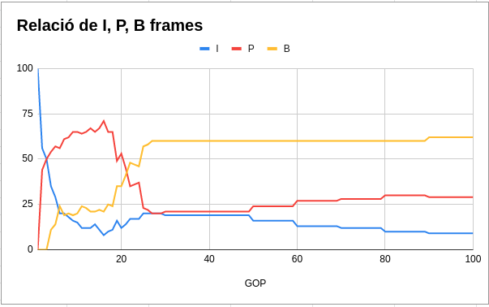
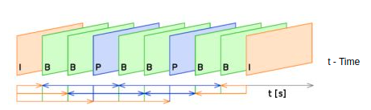
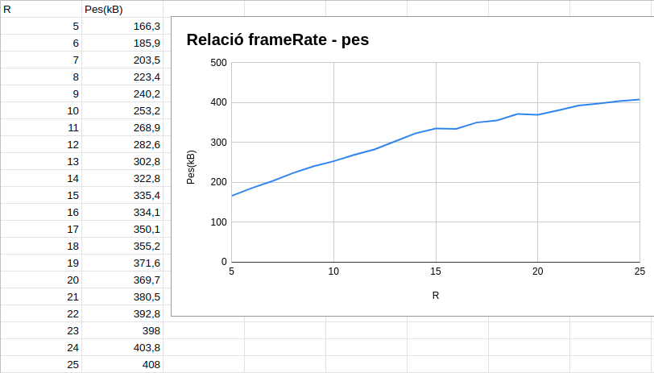
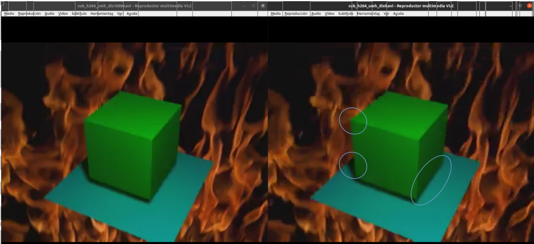

# FFMPEG
**Exercici 1.**

Expliqueu el significat de la informació proporcionada per la notació DEVILS.

La notacio D.E.V.I.L.S part de les sigles del que poden fer els diferents codecs

D &#8594; Soporta Decode

E &#8594; Soporta Encode

V|A|S &#8594; Tipus del contigut, Video, Audio o Subtitle

I &#8594; Intra frame-only

L &#8594; Soporta el algoritme de compresio amb perdua

S &#8594; Soporta el algoritme de compresio sense perdua


---

**Exercici 2.**

Comproveu quin és el suport que teniu, en el vostre sistema, pels còdecs mjpeg,
mpeg1video, mpeg4 i h264. Quins utilitzen compressió intra-quadre, inter-quadre o
ambdós? Quin/s és/són més similar/s al còdec que esteu desenvolupant a pràctiques?

mjpeg &#8594; D.E.V.I.L

mpeg1video &#8594; D.E.V..L

mpeg4 &#8594; D.E.V..L

h264 -&#8594; D.E.V..L.S

---

**Exercici 3.**

Compareu els diferents còdecs anteriors de forma quantitativa en quant a temps de
CPU, memòria utilitzada en el processat i mida del fitxer resultant (e.g. du –sh
<nom_del_fitxer> o bé ls –la <nom_del_fitxer>). Observeu el resultat de la
compressió en cada cas i ordeneu, de forma qualitativa, la qualitat obtinguda amb cada un dels
còdecs.

Mida de l'arxiu:

mjpeg &#8594; 564K

mpeg1video &#8594; 224K

mpeg4 &#8594; 192K

h264 &#8594; 388K

Com es pot observar el que te una major mida es el de MJPEG i el de menor el mpeg4.

| MJPEG   | MPEG1video |
| ---------|:------:|
|||

| MPEG4   | H264 |
| ---------|:------:|
|||


Si ens quedem amb els valors del final (utime, rtime). Veiem que el h264 es el que més temps ha trigat en la cpu i en memòria

I de forma qualitativa, el codec amb millor qualitat seria el de h264, els altres es poden veure distorsions en el resultat final.

---

**Exercici 4.**
Realitzeu una taula amb els ràtios de compressió que obtenim amb els diferents còdecs
respecte a la mida total del fitxer comprimit amb mjpeg. Per què prenem aquest fitxer com a referència? 

| Codec       | ratio |
| ----------- |:------:|
|	mpeg1video|2.517857|
|	mpeg4	  |2.9375|
|	h264	  |1.453608|


---

**Exercici 5.**
Aneu modificant el GOP mitjançant el paràmetre corresponent (e.g. entre 1 i 100),
mantenint el nombre d’imatges de referència a 0 i el framerate a 25. Fixeu-vos en la sortida per
tal de visualitzar la proporció de frames I i P. Feu una gràfica de com és modifica el ràtio de
compressió en funció d’aquesta proporció. Expliqueu el resultat

Com podem veure a la seguent imatge: 



La ràtio de i i p es van modificant amb prioritat, podem veure que hi té prioritat per créixer va amb aquest ordre, b, p i per últim i, aquesta és la que es fa petita més ràpida, fins que dóna la majoria de la seva proporció a b i p, que aquestes a posterior, s'aniran repartint la proporció decantant-se més a b. Això és normal si tenim en compte si els I són frames que inclouen tota la dada de la imatge, P seran frames que inclouen informació de canvis entre P o I i per últim les B es basa de frames que han sigut codificats a través de dues imatges de referència. Ens beneficia d'aquesta forma tenir el màxim de B frames, ja que ocupen 10% del que ocupa un I frame. 



---

**Exercici 6.**


Mantenint el GOP i el nombre d’imatges de referència constants, i sense modificar el
framerate a l’entrada, modifiqueu el de sortida en valors entre 5 i 25. Genereu una gràfica amb
la mida dels fitxers resultants. És el que esperàveu? Quin creieu que és el motiu? Observeu alguna
relació quantitativa entre el framerate i la mida del fitxer?


Ens podíem imaginar que el pes seria major en anar pujant de framerate, com podem veure a la gràfica, hem encertat de ple. Això és degut de quan de major és el framerate major són els fotogrames per segon, i el càlcul serà més pesat per més imatges a encapsular.

---

**Exercici 7.**

Compareu el temps de processat respecte a la mida del fitxer obtingut amb les funcions de comparació sum of absolute differences (sad), sum of squared errors (sse), sum of absolute Hadamard transformed differences (satd) i chroma (igual que sad però utilitzant la informació del color, en comptes de només la lluminositat). 

Segons aquests resultats, quina és la més convenient a utilitzar? 

Expliqueu breument també el funcionament de les 4 opcions.

### SAD

Donades dues tessel·les, una per a treballar i una altra per a comparar, es calcula la diferència de tots els píxels entre les dues tessel·les. És l'opció que es troba per defecte

### SSE

Es calcula la suma de les arrels dels residus.

### SATD

Donades dues tessel·les, es calculen les seves transformacions Hadamard  i després se suma la diferència entre elles.

### Chroma

No he trobat informació al respecte

### MJPG
|Funció|Temps (s)|Mida|
|:--:|:-----:|:--:|
|SAD|0.279|564K|
|SSE|0.270|564K|
|SATD|0.260|564K|
|CHROMA|0.263|564K|

### MPEG1VIDEO
|Funció|Temps (s)|Mida|
|:--:|:-----:|:--:|
|SAD|0.237|224K|
|SSE|0.239|220K|
|SATD|0.253|252K|
|CHROMA|0.271|220K|


### MPEG4
|Funció|Temps (s)|Mida|
|:--:|:-----:|:--:|
|SAD|0.235|192K|
|SSE|0.251|192K|
|SATD|0.263|204KK|
|CHROMA|0.273|188K|


### H264
|Funció|Temps (s)|Mida|
|:--:|:-----:|:--:|
|SAD|1.442|388K|
|SSE|1.397|388K|
|SATD|1.392|388K|
|CHROMA|1.528|388K|


---

**Exercici 8.**

Compareu el temps de processat amb la mida del fitxer resultant dels algoritmes de
cerca de desplaçament diamond (dia), hexagon (hex), uneven multi-hexagon (umh) i complert
(amb full o bé amb el seu àlies esa). Quin considereu més òptim en el nostre cas? Expliqueu
breument també el funcionament de les 4 opcions.

### DIAMOND:
La posició anterior coneguda ho marco com un 0 i les posicions per intentar posteriorment un 1
 ```
-1-
101
-1-
```
### HEXAGON:
El patro de 1 és iterat, i el de 2 es fan a posterior que tots els 1 s'han iterat. 
```
-1-1-
-222-
12021
-222-
-1-1-
```
### MULTI-HEXAGON:
Hi ha tres petrons diferents que s'executen un a un i posteriorment canvia al mateix patró que l'hexagon. 

```
                3


        3       3       3


          3           3
3               3               3
                1
    3       3       3       3
                1
3       3       3       3       3
    3         3 1 3         3
        3   3 22222 3   3
            3 22122 3
31 131 131 13121012131 131 131 13
            3 22122 3
        3   3 22222 3   3
    3         3 1 3         3
3       3       3       3       3
                1
    3       3       3       3
                1
3               3               3
          3           3


        3       3       3


                3

```
### COMPLERT: 
Aquest comprova totes les posicions fent-ho de forma exhaustiva.
```
              ...
   111111111111111111111111
   111111111111111111111111
   111111111111111111111111
   111111111111111111111111
   111111111111111111111111
   111111111111111111111111
   111111111111111111111111
...111111111111011111111111...
   111111111111111111111111
   111111111111111111111111
   111111111111111111111111
   111111111111111111111111
   111111111111111111111111
   111111111111111111111111
   111111111111111111111111
              ...
```

Com podem veure els resultats ens demostren que el millor codec respecte qualitat és el h264. A on l'algorisme altera el pes del fitxer, mentre que els altres l'algoritme no modifica el pes. Per trobar la forma més òptima, ens fixarem amb la velocitat de processament i la resolució. No veiem molt canvi entre els algorismes, però sí que notem que el esa, el complet sembla ser una mica més nítid i fluid, ara bé, és el que ocupa més i tarda força més temps a processar. Al no veure canvi entendrem que en aquest cas la millor opció és sacrificar espai i temps de processament.


---

**Exercici 9.**

Fixant el mètode d’estimació de desplaçament a umh, proveu diferents valors del rang
de cerca de desplaçament. Quin valor resulta més òptim?


Hem testejat amb valors entre el 0 i el 100, ja que no teníem referència del que és normal, hem vist que en Dvix s'usa un 1024, llavors hem fet una prova de 0 a 10000 de 1000 en 1000, a on com podem veure a la imatge, el de 10000 està pitjor que el de 0, es pot observar en els cercles dibuixats que la línia del costat dret del cub no està tan definida com el de 0, la cantonada es veu molt més recta al de 0 i l'ombra es veu massa negra i sembla que hi ha alguna alteració de part del foc en la de 10000.

---

**Exercici 10.**

Tenint en conte els resultats de tots els exercicis anterior, proposeu quin creieu que és
i per què el millor set de paràmetres a utilitzar amb el còdec h264. Utilitzeu el ffmpeg per
generar aquest vídeo i comproveu visualment que la qualitat de la imatge és l’adequada.

Hem de comptar amb un HOP 100, el frameRate que ens marca els fotogrames per segon, segons molts estudis el màxim de fotografies que pot captar un ull humà, així veient-ho al més fluid possible son de 40-60 fps, així que el FramexSecond el posarem en volts de 60, utilitzem el còdec h264 amb SATD, HEX amb una distància de 1024, com ho fa el DivX. Ja que hem pogut comprovar que elevar molt més la distància fa que es confonguin coses, i que els canvis sobtats com cantonades a vegades no es tractin correctament. Aquesta seria la millor resolució tenint en compte la velocitat i el que entenem nosaltres com a preferent fluidessa i nitedat intentant que sigui rapid i no ocupi més del compte. 
