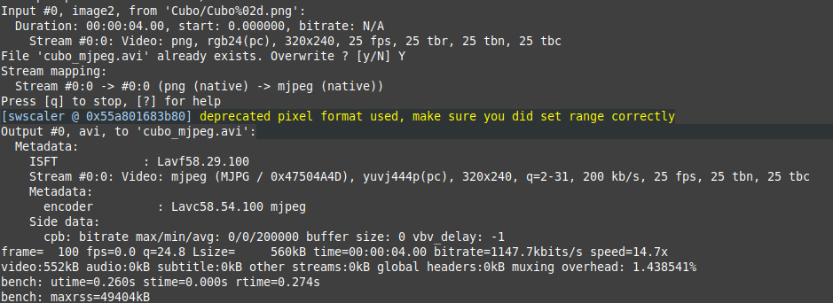
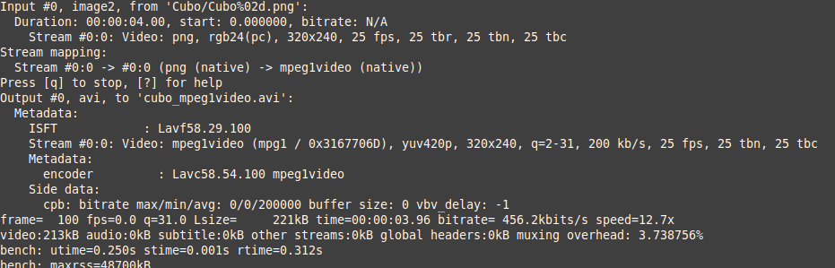
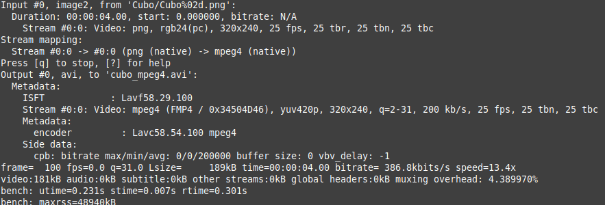
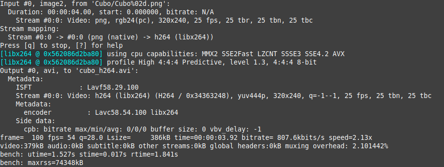

# FFMPEG
Exercici 1. Expliqueu el significat de la informació proporcionada per la notació DEVILS.

La notacio D.E.V.I.L.S part de les sigles del que poden fer els diferents codecs

D &#8594; Soporta Decode

E &#8594; Soporta Encode

V|A|S &#8594; Tipus del contigut, Video, Audio o Subtitle

I &#8594; Intra frame-only

L &#8594; Soporta el algoritme de compresio amb perdua

S &#8594; Soporta el algoritme de compresio sense perdua

---

Exercici 2. Comproveu quin és el suport que teniu, en el vostre sistema, pels còdecs mjpeg,
mpeg1video, mpeg4 i h264. Quins utilitzen compressió intra-quadre, inter-quadre o
ambdós? Quin/s és/són més similar/s al còdec que esteu desenvolupant a pràctiques?

mjpeg &#8594; D.E.V.I.L

mpeg1video &#8594; D.E.V..L

mpeg4 &#8594; D.E.V..L

h264 -&#8594; D.E.V..L.S

---

Exercici 3. Compareu els diferents còdecs anteriors de forma quantitativa en quant a temps de
CPU, memòria utilitzada en el processat i mida del fitxer resultant (e.g. du –sh
<nom_del_fitxer> o bé ls –la <nom_del_fitxer>). Observeu el resultat de la
compressió en cada cas i ordeneu, de forma qualitativa, la qualitat obtinguda amb cada un dels
còdecs.

Mida de l'arxiu:

mjpeg &#8594; 564K

mpeg1video &#8594; 224K

mpeg4 &#8594; 192K

h264 &#8594; 388K

Com es pot observar el que te una major mida es el de MJPEG i el de menor el mpeg4.

| MJPEG   | MPEG1video |
| ---------|:------:|
|||

| MPEG4   | H264 |
| ---------|:------:|
|||

Si ens quedem amb els valors del final (utime, rtime). Veiem que el h264 es el que més temps ha trigat en la cpu i en memòria

I de forma qualitativa, el codec amb millor qualitat seria el de h264, els altres es poden veure distorsions en el resultat final.

---

Exercici 4. Realitzeu una taula amb els ràtios de compressió que obtenim amb els diferents còdecs
respecte a la mida total del fitxer comprimit amb mjpeg. Per què prenem aquest fitxer com a
referència? 

| Codec       | ratio |
| ----------- |:------:|
|	mpeg1video|2.517857|
|	mpeg4	  |2.9375|
|	h264	  |1.453608|

MIRAR PORQUE SE USA DE REFENRECIA

---

Exercici 5. Aneu modificant el GOP mitjançant el paràmetre corresponent (e.g. entre 1 i 100),
mantenint el nombre d’imatges de referència a 0 i el framerate a 25. Fixeu-vos en la sortida per
tal de visualitzar la proporció de frames I i P. Feu una gràfica de com és modifica el ràtio de
compressió en funció d’aquesta proporció. Expliqueu el resultat

---

Exercici 6. Mantenint el GOP i el nombre d’imatges de referència constants, i sense modificar el
framerate a l’entrada, modifiqueu el de sortida en valors entre 5 i 25. Genereu una gràfica amb
la mida dels fitxers resultants. És el que esperàveu? Quin creieu que és el motiu? Observeu alguna
relació quantitativa entre el framerate i la mida del fitxer?

---

Exercici 7. Compareu el temps de processat respecte a la mida del fitxer obtingut amb les funcions
de comparació sum of absolute differences (sad), sum of squared errors (sse), sum of absolute
Hadamard transformed differences (satd) i chroma (igual que sad però utilitzant la informació
del color, en comptes de només la lluminositat). Segons aquests resultats, quina és la més
convenient a utilitzar? Expliqueu breument també el funcionament de les 4 opcions.

---

Exercici 8. Compareu el temps de processat amb la mida del fitxer resultant dels algoritmes de
cerca de desplaçament diamond (dia), hexagon (hex), uneven multi-hexagon (umh) i complert
(amb full o bé amb el seu àlies esa). Quin considereu més òptim en el nostre cas? Expliqueu
breument també el funcionament de les 4 opcions.

---

Exercici 9. Fixant el mètode d’estimació de desplaçament a umh, proveu diferents valors del rang
de cerca de desplaçament. Quin valor resulta més òptim?

---

Exercici 10. Tenint en conte els resultats de tots els exercicis anterior, proposeu quin creieu que és
i per què el millor set de paràmetres a utilitzar amb el còdec h264. Utilitzeu el ffmpeg per
generar aquest vídeo i comproveu visualment que la qualitat de la imatge és l’adequada.
